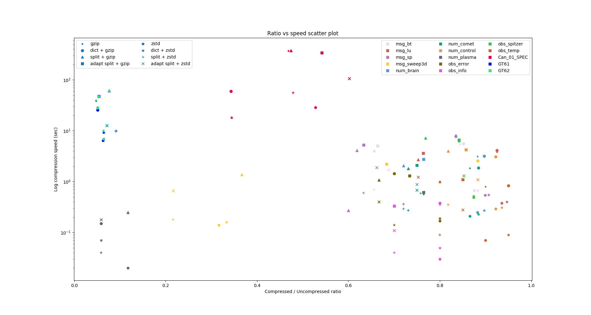

# What this is all about
This project includes a benchmark for evaluating the achieved comperession ratio and speed of different configurations of Apache Parquet and Apache Arrow.
The tables below include metrics for the following configurations:
* PLAIN encoding, UNCOMPRESSED
* PLAIN encoding, GZIP
* PLAIN encoding, ZSTD
* DICTIONARY encoding, GZIP
* DICTIONARY encoding, ZSTD
* BYTE_STREAM_SPLIT encoding, GZIP
* BYTE_STREAM_SPLIT encoding, ZSTD
* ADAPTIVE_BYTE_STREAM_SPLIT encoding, GZIP
* ADAPTIVE_BYTE_STREAM_SPLIT encoding, ZSTD

The *BYTE_STREAM_SPLIT* and *ADAPTIVE_BYTE_STREAM_SPLIT* encodings are new, designed by me and not yet part of the Apache Parquet project.
For the not-production-level C++ implementation of both, you can check my fork of Apache Arrow: https://github.com/martinradev/arrow.

The *BYTE_STREAM_SPLIT* encoding takes values in an array and scatters each byte of a value to different streams.
There are four streams for 32-bit floating-point values and eight streams for 64-bit floating-point values.
After the bytes of all values are scatter, the streams are concatenated.
Note that this encoding does not reduce the size of the array but makes it potentially more compressible. Thus, it is important to use a compression algorithm.

The *ADAPTIVE_BYTE_STREAM_SPLIT* encoding attempts to improve results of *BYTE_STREAM_SPLIT* encoding for cases when data in the array is very repetitive and a combination of PLAIN encoding and a compression algorithm achieve better results.
This encoding divides the array into blocks of K values. For each block it uses are heuristic to determine whether using the BYTE_STREAM_SPLIT encoding for the smaller block would achieve better results than using PLAIN encoding for it. For each block it has to store an additional *type bit* to be able to determine what encoding was used when decoding. This adds an overhead in storage because at least N/K bits are necessary for storing the types where N is the number of values in the array and K is the block size. Also, the heuristic can be complex enough that encoding is slow.
A possible heuristic can be seen in my Arrow fork patches. It is based on this idea: http://romania.amazon.com/techon/presentations/DataStreamsAlgorithms_FlorinManolache.pdf

# ARROW's default compression level
## Compression ratio
Measurements are in *megabytes*.
### Data with only one column. Data has high 0-order-entropy when the distribution is over the values (4 bytes).

| Combination \ F32 data            | msg_bt | msg_lu | msg_sp | msg_sweep3d | num_brain | num_comet | num_control | num_plasma | obs_error | obs_info | obs_spitzer | obs_temp |
|-----------------------------------|--------|--------|--------|-------------|-----------|-----------|-------------|------------|-----------|----------|-------------|----------|
| no compression                    | 128    | 93     | 139    | 60          | 68        | 52        | 77          | 17         | 30        | 10       | 95          | 20       |
| gzip                              | 108    | 86     | 116    | 53          | 60        | 45        | 71          | 13         | 21        | 8        | 80          | 18       |
| dictionary + gzip                 | 109    | 86     | 116    | 53          | 61        | 46        | 71          | 1          | 21        | 8        | 80          | 19       |
| byte_stream_split + gzip          | 84     | 70     | 86     | 22          | 49        | 38        | 63          | 2          | 20        | 6        | 73          | 16       |
| adaptive byte_stream_split + gzip | 85     | 71     | 88     | 41          | 52        | 39        | 66          | 13         | 22        | 7        | 80          | 17       |
| zstd                              | 112    | 87     | 125    | 19          | 60        | 45        | 71          | 2          | 24        | 8        | 83          | 18       |
| dictionary + zstd                 | 113    | 88     | 126    | 20          | 61        | 46        | 72          | 1          | 24        | 8        | 83          | 19       |
| byte_stream_split + zstd          | 84     | 67     | 88     | 13          | 49        | 38        | 63          | 1          | 21        | 7        | 72          | 16       |
| adaptive byte_stream_split + zstd | 88     | 70     | 92     | 13          | 51        | 39        | 68          | 1          | 20        | 7        | 81          | 17       |

### Multiple columns but data is extremely repetitive.
| Combination \ mixed data          | Can_01_SPEC | GT61 | GT62 |
|-----------------------------------|-------------|------|------|
| no compression                    | 3300        | 2414 | 2429 |
| gzip                              | 1545        | 115  | 116  |
| dictionary + gzip                 | 1131        | 123  | 124  |
| byte_stream_split + gzip          | 1565        | 184  | 186  |
| adaptive byte_stream_split + gzip | 1788        | 130  | 129  |
| zstd                              | 1741        | 153  | 156  |
| dictionary + zstd                 | 1135        | 156  | 154  |
| byte_stream_split + zstd          | 1581        | 222  | 221  |
| adaptive byte_stream_split + zstd | 1985        | 173  | 173  |

We can see that the *byte_stream_split encoding* improves the compression ratio for the majority of test cases.

The *adaptive byte_stream_split encoding* is only useful for whenever the data is very repetitive as is the case for the GT61 and GT62 tests. For all other cases, the encoding is not competitive due to the overhead from storing block types, encoding at the block level and less than ideal heuristic.

The *dictionary encoding* only produces good results for the Can_01_SPEC, GT61, GT62 and num_plasma which are tests with very repetitive data. For all other is typically worse than the *plain encoding*.

## Compression speed
Measurements are in *seconds*.

| Combination \ F32 data            | msg_bt | msg_lu | msg_sp | msg_sweep3d | num_brain | num_comet | num_control | num_plasma | obs_error | obs_info | obs_spitzer | obs_temp |
|-----------------------------------|--------|--------|--------|-------------|-----------|-----------|-------------|------------|-----------|----------|-------------|----------|
| gzip                              | 5.43   | 3.84   | 8.18   | 2.55        | 3.16      | 1.83      | 3.04        | 0.57       | 1.42      | 0.35     | 6.38        | 0.80     |
| dictionary + gzip                 | 5.55   | 4.12   | 7.75   | 2.56        | 3.20      | 1.86      | 3.08        | 0.15       | 1.45      | 0.38     | 6.35        | 0.84     |
| byte_stream_split + gzip          | 4.07   | 2.72   | 4.12   | 1.39        | 2.06      | 1.81      | 4.01        | 0.25       | 1.08      | 0.27     | 7.23        | 1.00     |
| adaptive byte_stream_split + gzip | 5.06   | 3.65   | 5.24   | 2.22        | 2.74      | 2.09      | 4.27        | 0.62       | 1.31      | 0.33     | 6.61        | 1.10     |
| zstd                              | 0.67   | 0.38   | 0.54   | 0.14        | 0.25      | 0.21      | 0.29        | 0.02       | 0.17      | 0.03     | 0.49        | 0.07     |
| dictionary + zstd                 | 0.67   | 0.40   | 0.55   | 0.16        | 0.27      | 0.23      | 0.31        | 0.07       | 0.19      | 0.05     | 0.52        | 0.09     |
| byte_stream_split + zstd          | 0.70   | 0.36   | 0.60   | 0.18        | 0.29      | 0.27      | 0.35        | 0.04       | 0.14      | 0.04     | 0.59        | 0.09     |
| adaptive byte_stream_split + zstd | 1.72   | 1.23   | 1.89   | 0.66        | 0.88      | 0.68      | 1.09        | 0.18       | 0.40      | 0.11     | 1.31        | 0.28     |

| Combination \ mixed data          | Can_01_SPEC | GT61  | GT62  |
|-----------------------------------|-------------|-------|-------|
| gzip                              | 374.48      | 39.12 | 40.26 |
| dictionary + gzip                 | 60.29       | 25.51 | 28.23 |
| byte_stream_split + gzip          | 381.25      | 61.40 | 62.89 |
| adaptive byte_stream_split + gzip | 340.57      | 47.36 | 46.97 |
| zstd                              | 28.91       | 6.40  | 6.89  |
| dictionary + zstd                 | 18.04       | 9.25  | 10.13 |
| byte_stream_split + zstd          | 55.48       | 9.99  | 9.64  |
| adaptive byte_stream_split + zstd | 107.00      | 12.73 | 12.77 |

Using the *adaptive byte_stream_split encoding* typically leads to slower creation of parquet files. The is expected because the type heuristic has to read the whole block and approximate the most occurring elements. The improvement in compression ratio over the dictionary encoding and plain encoding is not high enough for the majority of tests so that the reduction in IO-usage can lead to a better performance. The adaptive encoding still produces better results for when GZIP is used. A reason could be that the transformed input is faster to parse in GZIP than for the plain or dictionary-produced input.

Using *byte_stream_encoding* with GZIP also leads to faster creation of parquet files. When ZSTD is used, there seems to be almost no performance difference between this encoding, plain and dictionary encoding. A reason could be that the time for apply the encoding and time for writing out the file to disk somehow even out.

*Dictionary encoding* achieves significantly better performance for highly repetitive data like Can_01_Spec, GT61 and GT62. The reason is that the compressed file size is smaller and less time is spent on IO.

## Combined scatter plot

This relative scatter plot includes all of the collected results for compression ratio and speed. The different symbol markers correspond to the encoding-compression algorithm combination and the color corresponds to a sample in the test data. For each color, markers located to the left, bottom or left-bottom are of interest.

Very high compression ratio is achieved for the GT61 and GT62 samples regardless of the encoding and compression algorithm. Plain encoding and zstd seems to be a good candidate because it achieves great compression ratio and is faster than any other combination.

For Can_01_SPEC the best combination is *dictionary + zstd*.

For almost any other case, the *BYTE_STREAM_SPLIT + zstd* combination tends to perform better in both compression ratio and speed.

# Different compression levels for ZSTD
## Compression ratio
Measurements are in *megabytes*.

| Data         | Level | zstd (MB) | dictionary + zstd (MB) | byte_stream_splt + zstd (MB) | adaptive byte_stream_split + zstd (MB) |
|--------------|-------|-----------|------------------------|------------------------------|----------------------------------------|
| msg_bt       |       |           |                        |                              |                                        |
|              | 1     | 112       | 113                    | 84                           | 89                                     |
|              | 4     | 110       | 111                    | 80                           | 84                                     |
|              | 7     | 110       | 111                    | 80                           | 83                                     |
|              | 10    | 110       | 111                    | 80                           | 82                                     |
| msg_lu       |       |           |                        |                              |                                        |
|              | 1     | 87        | 88                     | 67                           | 70                                     |
|              | 4     | 87        | 88                     | 65                           | 67                                     |
|              | 7     | 87        | 87                     | 64                           | 65                                     |
|              | 10    | 87        | 87                     | 64                           | 65                                     |
| msg_sp       |       |           |                        |                              |                                        |
|              | 1     | 125       | 126                    | 88                           | 92                                     |
|              | 4     | 124       | 125                    | 86                           | 88                                     |
|              | 7     | 123       | 123                    | 85                           | 87                                     |
|              | 10    | 123       | 123                    | 85                           | 87                                     |
| msg_sweep3d  |       |           |                        |                              |                                        |
|              | 1     | 19        | 20                     | 13                           | 13                                     |
|              | 4     | 18        | 20                     | 12                           | 13                                     |
|              | 7     | 18        | 19                     | 12                           | 12                                     |
|              | 10    | 18        | 18                     | 12                           | 12                                     |
| num_brain    |       |           |                        |                              |                                        |
|              | 1     | 60        | 61                     | 49                           | 51                                     |
|              | 4     | 60        | 61                     | 48                           | 49                                     |
|              | 7     | 60        | 61                     | 48                           | 49                                     |
|              | 10    | 60        | 61                     | 48                           | 48                                     |
| num_comet    |       |           |                        |                              |                                        |
|              | 1     | 45        | 46                     | 38                           | 39                                     |
|              | 4     | 45        | 46                     | 38                           | 39                                     |
|              | 7     | 45        | 46                     | 38                           | 39                                     |
|              | 10    | 45        | 46                     | 38                           | 39                                     |
| num_control  |       |           |                        |                              |                                        |
|              | 1     | 71        | 72                     | 63                           | 68                                     |
|              | 4     | 71        | 72                     | 64                           | 65                                     |
|              | 7     | 71        | 72                     | 63                           | 65                                     |
|              | 10    | 71        | 72                     | 63                           | 65                                     |
| obs_error    |       |           |                        |                              |                                        |
|              | 1     | 24        | 24                     | 21                           | 21                                     |
|              | 4     | 20        | 21                     | 21                           | 20                                     |
|              | 7     | 20        | 21                     | 19                           | 20                                     |
|              | 10    | 20        | 20                     | 19                           | 20                                     |
| obs_info     |       |           |                        |                              |                                        |
|              | 1     | 8         | 8                      | 7                            | 7                                      |
|              | 4     | 7         | 7                      | 6                            | 6                                      |
|              | 7     | 6         | 7                      | 5                            | 5                                      |
|              | 10    | 6         | 7                      | 5                            | 5                                      |
| obs_spitzer  |       |           |                        |                              |                                        |
|              | 1     | 83        | 83                     | 72                           | 81                                     |
|              | 4     | 77        | 77                     | 73                           | 78                                     |
|              | 7     | 75        | 75                     | 72                           | 77                                     |
|              | 10    | 75        | 75                     | 72                           | 77                                     |
| obs_temp     |       |           |                        |                              |                                        |
|              | 1     | 18        | 19                     | 16                           | 17                                     |
|              | 4     | 18        | 19                     | 16                           | 17                                     |
|              | 7     | 18        | 19                     | 16                           | 17                                     |
|              | 10    | 18        | 19                     | 16                           | 17                                     |
| GT61         |       |           |                        |                              |                                        |
|              | 1     | 153       | 156                    | 222                          | 162                                    |
|              | 4     | 142       | 128                    | 203                          | 148                                    |
|              | 7     | 121       | 120                    | 182                          | 128                                    |
|              | 10    | 120       | 119                    | 180                          | 126                                    |
| GT62         |       |           |                        |                              |                                        |
|              | 1     | 156       | 154                    | 221                          | 163                                    |
|              | 4     | 145       | 132                    | 205                          | 150                                    |
|              | 7     | 123       | 122                    | 184                          | 128                                    |
|              | 10    | 122       | 121                    | 181                          | 127                                    |

Note that there is a small discrepancy between ZSTD with level 1 and the tables from before for the ADAPTIVE_STREAM_SPLIT_ENCODING. The small difference in compression ratio is due to tweaks in the heuristic midway generating the data for the tables. Because it takes some time to re-generate the tables, I decided to leave it as it is because the difference is very small.
